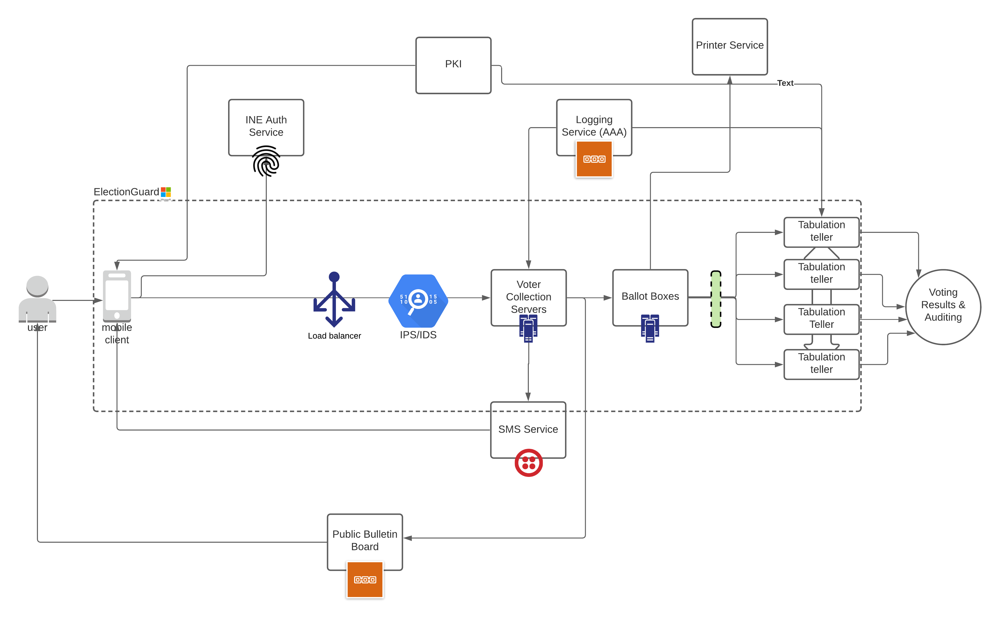

# Socrates Mobile
## IBM challenge

This is the client application prototype for an Online Voting System proposal named Socrates, developed in a Hackathon and inspred on the Norweigan, Estonian, Helios and Civitas solutions. 

### What is Socrates?
Socrates is an **auditable**, **coercion-resistant**, **individually and universally-verifiable** voting system that uses distributed vote collection servers, blockain logging services, homomorphic encryption, public key infrastructure, and features a public bulletin board for storing the unique votes' hashes.

Socrates looks to serve as a simple, efficient and secure solution for remote voting in the context of social-distancing, as well as enabling groups that were excluded from the voting process before due to physical reasons, like people in retirement homes, hospitals, offshore, expats, and others unable to leave their homes.

### Socrates Mobile Application
The application prototype is built using React Native and Expo, and performs a single post request to IBM cloud and only after authenticating, to reduce the probability of MiTM attacks and ensure transparency of the system at the same time.

### Why Mobile?
Socrates is a System that considers multiple means of casting a vote, including on-site paper voting.
However, mobile phones are a personal item that, with the proper hardware, can be used for accessing with fingerprint, facial recognition and proofs-of-life, preventing vote fraud entirely and providing an official means of authentication with the election authority's database, without storing any personal data in the client.

### Features
- The application is designed to be simple and straightforward to use.   
- The voter follows a sequence of well-documented steps and can understand with minimum technical expertise.  
- The voter is able to verify that their vote is:
    1. registered-as-cast (by checking that the received OTP code by SMS matches their one-time ballot),  and
    2. that it is cast-as-stored (by checking the hash in the Public Bulletin Board).  
- The end user is able to detect any errors or alterations to its recorded vote from end device to vote collection server immediately and can report them to a dedicated phone number.  
- To avoid voter coercion, the voter is allowed **revote**: to cast a vote as many times as needed. Only the last vote is the one that will be counted.  

### Technologies
This Socrates mobile front end prototype uses:
- Local authentication with fingerprint scanner
- RSA encryption 
- React Native UI
- IBM Cloud functions as an endpoint for the casting https request

### Contributors
This project and proposal was possible thanks to: Lia, Oscar, Karla and Eric.

